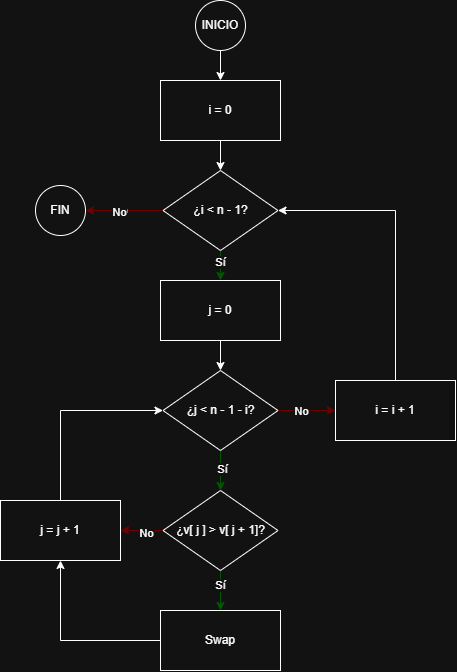

# Bubble Sort (Ordenación por burbuja)

## Objetivo
Ordenar un array/lista de datos en orden creciente comparando elementos adyacentes e intercambiándolos
si están en el orden incorrecto.

---

## 1) Descripción textual
El algoritmo recorre la lista varias veces. En cada pasada, compara cada elemento con el siguiente.
Si el elemento actual es mayor que el siguiente, los intercambia.
Al final de una pasada completa, el elemento más grande de la parte no ordenada queda colocado al final
(como si "subiera" a su posición). Se repite este proceso hasta que se han realizado suficientes pasadas
para garantizar que toda la lista está ordenada.

---

## 2) Lista de operaciones
1. Obtener el tamaño 'n' de la lista.
2. Repetir n-1 pasadas:
    1. Recorrer la parte no ordenada desde el inicio hasta 'n-2-i'. (Porque al final ya están los elementos ordenados)
   2. En cada posición 'j', comparar el elemento actual con el siguiente.
   3. Si el actual es mayor que el siguiente, intercambiamos ambos valores.
3. Cuando terminan las pasadas, la lista está ordenada.

---

## 3) Diagrama de flujo

---

## 4) Pseudocódigo
```text
ALGORITMO BubbleSort(lista)
    n ← tamaño(lista)

    // Hacemos varias pasadas sobre la lista
    PARA i ← 0 HASTA n-2 HACER

        // En cada pasada comparamos parejas adyacentes
        // El mayor de la parte no ordenada acabará al final
        PARA j ← 0 HASTA (n-2-i) HACER
            SI lista[j] > lista[j+1] ENTONCES
                INTERCAMBIAR lista[j] CON lista[j+1]
            FIN SI
        FIN PARA

    FIN PARA

    DEVOLVER lista ordenada
FIN ALGORITMO
```