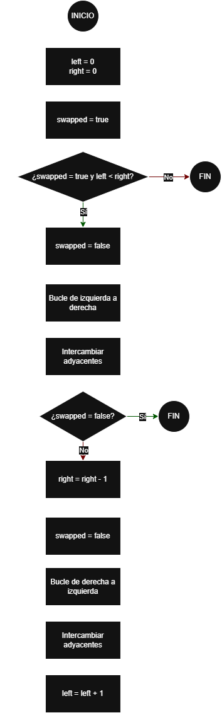

# CocktailSort

## Objetivo
Ordenar una lista de números en orden creciente. CocktailSort es una variante de BubbleSort
que realiza pasadas en ambos sentidos:

- Izquierda a derecha: empuja el máximo hacia el final.
- Derecha a izquierda: empuja el menor hacia el principio.

---

## 1) Descripción textual
El algoritmo mantiene un rango de elementos que aún pueden estar desordenados (entre un límite
izquierdo y uno derecho). Primero recorre ese rango de izquierda a derecha, comparando 
elementos adyacentes e intercambiándolos si están mal ordenados. Al terminar esa pasada, el 
mayor elemento del rango queda colocado al final. Después recorre el rango en sentido
contrario (de derecha a izquierda), haciendo lo mismo. Al terminar, el menor elemento del
rango queda colocado al principio. En cada ciclo, el rango se reduce porque ya se fijan 
un mínimo y un máximo. El proceso se repite hasta que no haya intercambios o el rango quede
vacío.

---

## 2) Lista de operaciones
1. Inicializar `left = 0` y `right = n-1`.
2. Repetir mientras haya intercambios y `left < right`:
    1. Marcar `swapped = falso`.
    2. Pasada izquierda → derecha desde `left` hasta `right-1`:
        - Si `lista[i] > lista[i+1]`, intercambiar y poner `swapped = verdadero`.
    3. Si no hubo intercambios, terminar (ya está ordenado).
    4. Reducir `right` en 1 (el máximo ya está colocado al final).
    5. Marcar `swapped = falso`.
    6. Pasada derecha → izquierda desde `right` hasta `left+1`:
        - Si `lista[i-1] > lista[i]`, intercambiar y poner `swapped = verdadero`.
    7. Aumentar `left` en 1 (el mínimo ya está colocado al inicio).
3. La lista queda ordenada.

---

## 3) Diagrama de flujo (descripción de las figuras)



---

## 4) Pseudocódigo (descriptivo)
```text
ALGORITMO CocktailSort(lista)
    n ← tamaño(lista)
    left ← 0
    right ← n - 1
    swapped ← VERDADERO

    MIENTRAS swapped = VERDADERO Y left < right HACER
        swapped ← FALSO

        // Pasada de izquierda a derecha: colocar el máximo en right
        PARA i ← left HASTA right - 1 HACER
            SI lista[i] > lista[i+1] ENTONCES
                INTERCAMBIAR lista[i] CON lista[i+1]
                swapped ← VERDADERO
            FIN SI
        FIN PARA

        SI swapped = FALSO ENTONCES
            SALIR DEL BUCLE
        FIN SI

        right ← right - 1
        swapped ← FALSO

        // Pasada de derecha a izquierda: colocar el mínimo en left
        PARA i ← right HASTA left + 1 HACER (decreciendo)
            SI lista[i-1] > lista[i] ENTONCES
                INTERCAMBIAR lista[i-1] CON lista[i]
                swapped ← VERDADERO
            FIN SI
        FIN PARA

        left ← left + 1
    FIN MIENTRAS

    DEVOLVER lista ordenada
FIN ALGORITMO
