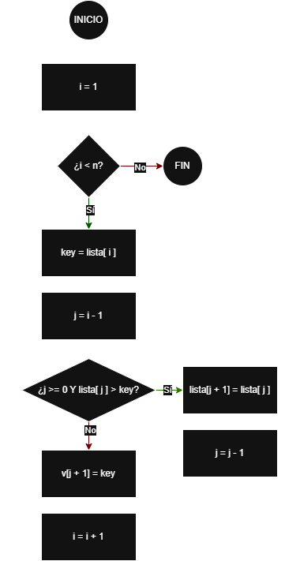

# InsertionSort

## Objetivo
Ordenar una lista de números en orden creciente insertando en su posición correcta dentro de 
una zona que se va manteniendo ordenada.

---

## 1) Descripción textual
El algoritmo considera que la primera parte de la lista está ordenada y va creciendo poco a 
poco. Se recorre la lista desde el segundo elemento. En cada paso, se toma el elemento actual
(llamado "clave") y se compara con los elementos anteriores (que ya están en la zona ordenada).
Cuando ya no hay elementos mayores, la clave se coloca en el hueco libre. Al finalizar, toda la
lista queda ordenada.

---

## 2) Lista de operaciones (pasos numerados)
1. Obtener el tamaño `n` de la lista.
2. Para cada índice `i` desde 1 hasta `n-1`:
    1. Guardar `key = lista[i]`.
    2. Inicializar `j = i - 1` (última posición de la zona ordenada).
    3. Mientras `j >= 0` y `lista[j] > key`:
        - Desplazar `lista[j]` a `lista[j+1]`.
        - Decrementar `j`.
    4. Insertar `key` en `lista[j+1]`.
3. La lista queda ordenada.

---

## 3) Diagrama de flujo (descripción de las figuras)


---

## 4) Pseudocódigo (descriptivo)
```text
ALGORITMO InsertionSort(lista)
    n ← tamaño(lista)

    // La posición i recorre la parte no ordenada.
    // La parte [0..i-1] se mantiene ordenada.
    PARA i ← 1 HASTA n-1 HACER
        key ← lista[i]
        j ← i - 1

        // Desplazar a la derecha todos los elementos mayores que key
        MIENTRAS j >= 0 Y lista[j] > key HACER
            lista[j + 1] ← lista[j]
            j ← j - 1
        FIN MIENTRAS

        // Insertar key en el hueco correcto
        lista[j + 1] ← key
    FIN PARA

    DEVOLVER lista ordenada
FIN ALGORITMO
