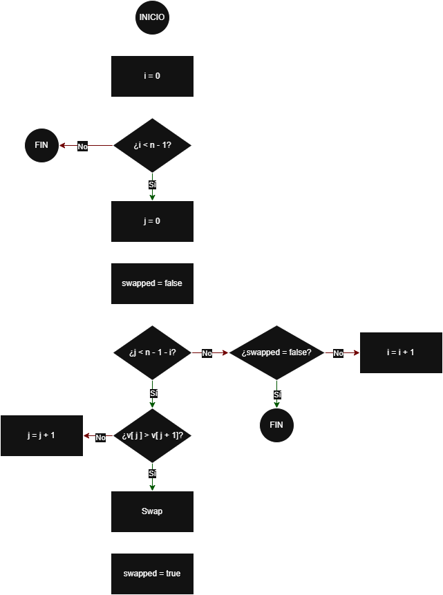

# BubbleSort Mejorado (Optimized Bubble Sort)

## Objetivo
Ordenar una lista de números en orden creciente comparando elementos
adyacentes e intercambiándolos si es necesario. Esta versión mejora 
BubbleSort deteniendo el algoritmo antes si detecta que la lista ya
está ordenada.

---

## 1) Descripción textual
El algoritmo recorre la lista por pasadas. En cada pasada compara elementos
consecutivos y los intercambia si están en el orden incorrecto. La 
diferencia con BubbleSort clásico es que en cada pasada registra si se ha
realizado algún intercambio. Si en una pasada completa no se intercambia
nada, significa que la lista ya está ordenada y el algoritmo termina
sin hacer más pasadas.

---

## 2) Lista de operaciones
1. Obtener el tamaño `n` de la lista.
2. Para cada pasada `i` desde 0 hasta `n-2`:
    1. Inicializar `swapped` como falso (aún no hubo intercambios).
    2. Recorrer la parte no ordenada desde `j = 0` hasta `j = n-2-i`:
        - Comparar `lista[j]` y `lista[j+1]`.
        - Si `lista[j] > lista[j+1]`, intercambiarlos y poner `swapped` a verdadero.
    3. Si al terminar la pasada `swapped` sigue siendo falso, terminar (la lista ya 
   está ordenada).
3. La lista queda ordenada.

---

## 3) Diagrama de Flujo
<p align="center">
    
</p>

---

## 4) Pseudocódigo
```text
ALGORITMO BubbleSortMejorado(lista)
    n ← tamaño(lista)

    PARA i ← 0 HASTA n-2 HACER
        swapped ← FALSO

        // Recorremos la parte no ordenada e intentamos "empujar" el mayor al final
        PARA j ← 0 HASTA (n-2-i) HACER
            SI lista[j] > lista[j+1] ENTONCES
                INTERCAMBIAR lista[j] CON lista[j+1]
                swapped ← VERDADERO
            FIN SI
        FIN PARA

        // Si no hubo intercambios, nadie estaba fuera de sitio: ya está ordenado
        SI swapped = FALSO ENTONCES
            SALIR DEL BUCLE
        FIN SI
    FIN PARA

    DEVOLVER lista ordenada
FIN ALGORITMO
