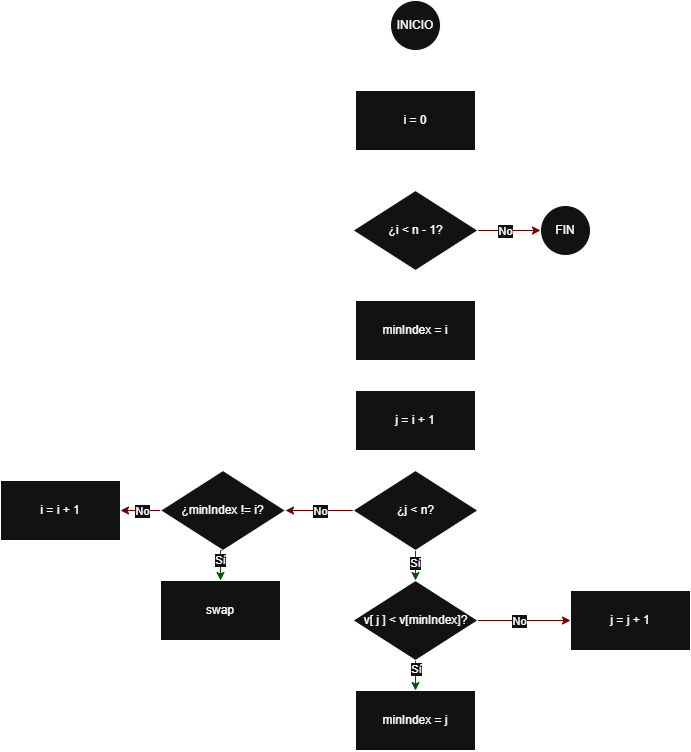

# SelectionSort

## Objetivo
Ordenar una lista de números en orden creciente seleccionando repetidamente el elemento mínimo
de la parte no ordenada y colocándolo en su posición correcta.

---
## 1) Descripción textual
El algoritmo divide la lista en dos zonas: una parte izquierda ya ordenada y una parte derecha
sin ordenar. En cada paso, se busca el valor más pequeño de la parte sin ordenar. Una vez localizado,
se intercambia con el primer elemento de esa parte sin ordenar. El proceso continúa hasta que 
toda la lista queda ordenada.

---

## 2) Lista de operaciones
1. Obtener el tamaño `n` de la lista.
2. Para cada posición `i` desde `0` hasta `n-2`:
    1. Suponer que el mínimo está en `minIndex = i`.
    2. Recorrer el resto de la lista desde `j = i+1` hasta `n-1`:
        - Si `lista[j]` es menor que `lista[minIndex]`, actualizar `minIndex`.
    3. Intercambiar `lista[i]` con `lista[minIndex]` para colocar el mínimo en la posición `i`.
3. Al terminar, la lista está ordenada.

---

## 3) Diagrama de flujo



---

## 4) Pseudocódigo (descriptivo)
```text
ALGORITMO SelectionSort(lista)
    n ← tamaño(lista)

    // i marca el inicio de la zona no ordenada
    PARA i ← 0 HASTA n-2 HACER
        minIndex ← i

        // Buscar el menor elemento en la parte no ordenada
        PARA j ← i+1 HASTA n-1 HACER
            SI lista[j] < lista[minIndex] ENTONCES
                minIndex ← j
            FIN SI
        FIN PARA

        // Colocar el mínimo encontrado en su posición final (i)
        SI minIndex ≠ i ENTONCES
            INTERCAMBIAR lista[i] CON lista[minIndex]
        FIN SI
    FIN PARA

    DEVOLVER lista ordenada
FIN ALGORITMO